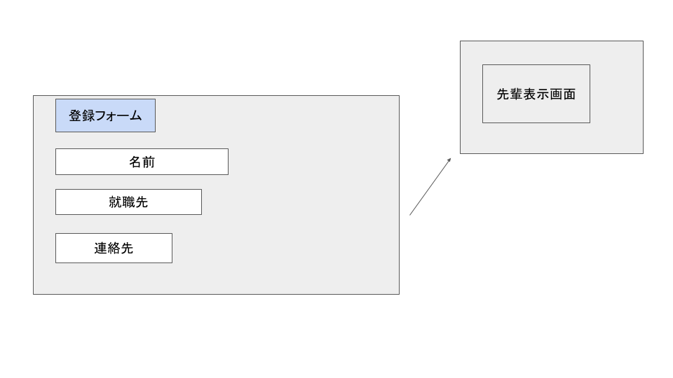

# ユースケース 13： 先輩情報を登録する

## 概要

先輩の就職先情報の登録を行う

## アクター

- ユーザー

## 事前条件

- システムに先輩の情報が登録されていないこと

## 事後条件

- システムに先輩の情報が登録されて状態になる

## トリガ―

- ユーザーがシステムを使い始めたとき

## 基本フロー

1. システムは，先輩登録画面を表示します
2. ユーザーは先輩の名前や就職先をフォームに入力する
3. システムは先輩情報を登録する
4. システムはその先輩を登録済みにする
5. システムは先輩閲覧画面を表示する(ユースケース15)

## 代替フロー

### 代替フロー1

- 3a.1  既に存在している先輩情報であった場合，システムは競合エラーを出す

## GUI紙芝居

### 登録画面

