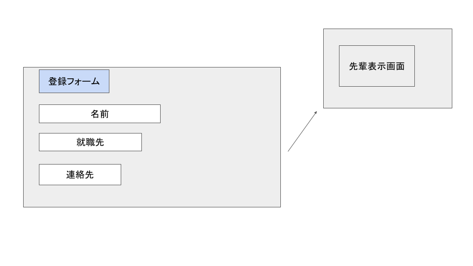

# ユースケース 14： 先輩情報を編集する

## 概要

先輩の就職先情報の編集を行う

## アクター

- ユーザー

## 事前条件

- システムに先輩の情報が登録されていること

## 事後条件

- システムの先輩の情報が更新された状態になる

## トリガ―

- ユーザーが先輩情報を編集しようとしたとき

## 基本フロー

1. システムは，先輩閲覧画面を表示します
2. ユーザーは編集したい先輩情報を選択し，編集ボタンを押します
3. システムは，先輩編集画面を表示します
4. ユーザーは先輩の名前や就職先をフォームで編集する
5. システムは先輩情報を更新する
6. システムは更新された先輩閲覧画面を表示する

## 代替フロー

### 代替フロー1

- 5a.1  存在しない先輩情報を編集しようとした場合，システムはエラーを表示する

## GUI紙芝居

### 先輩情報編集画面

