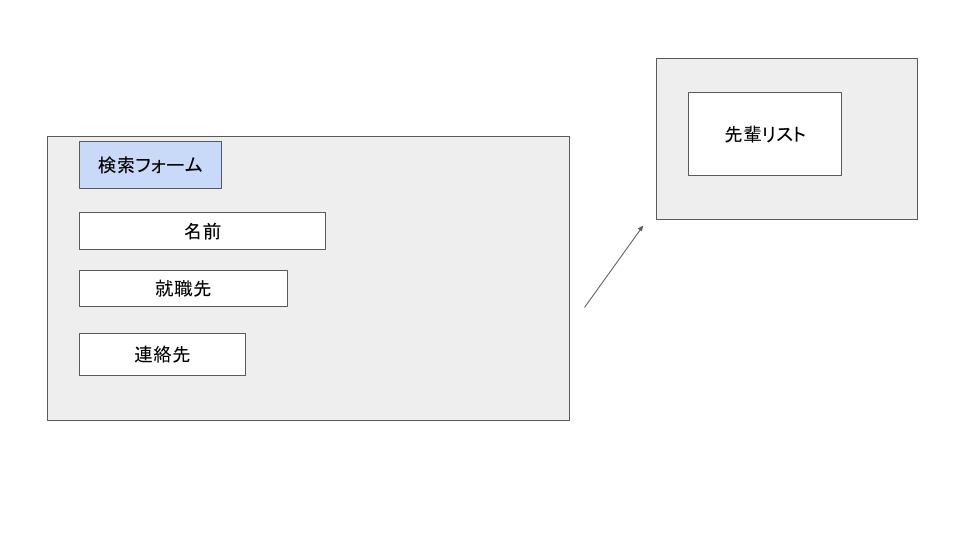

# ユースケース 15： 先輩情報を見る

## 概要

先輩の就職先情報の閲覧を行う

## アクター

- ユーザー

## 事前条件

- システムに先輩の情報が登録されていること

## 事後条件

- 特になし

## トリガ―

- ユーザーが先輩情報を見ようとしたとき

## 基本フロー

1. システムは，先輩閲覧画面を表示します
2. ユーザーはみたい先輩情報を検索する
3. システムは検索結果を表示する
4. ユーザーは見たい先輩情報を選択する
5. システムは選択された先輩の詳細情報を表示する

## 代替フロー

### 代替フロー1

- 2a.1  存在しない先輩情報を選択した場合，システムはエラーを表示する

## GUI紙芝居

### 先輩検索画面

